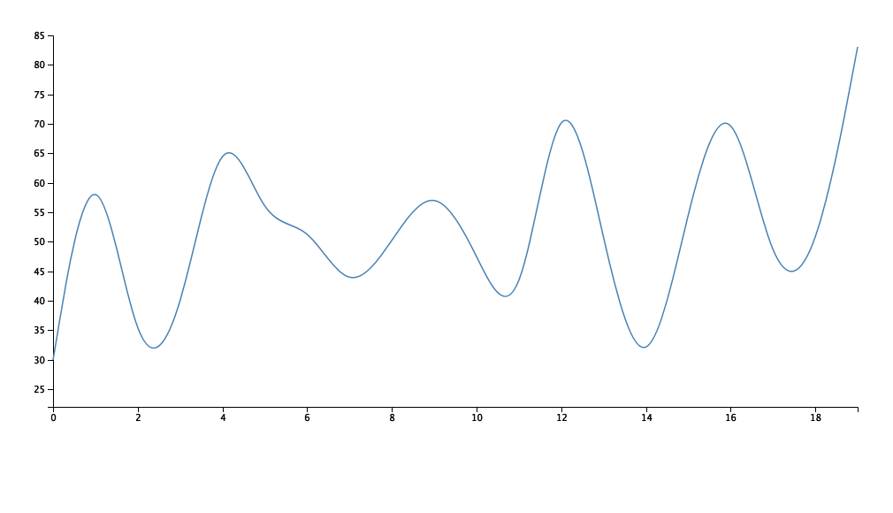

## LineChart

LineChart generator in node.js.

## Install

```bash
npm install d3node-linechart
```

## Usage

```js
const d3nLine = require('d3node-linechart');
const line = d3nLine(data, selector, container, style)
```

Check out the [example](./example) for usage.

##### Output the visualization result to a image

```
npm run build
```

## Output Preview (png):




## API

### d3nLine({ data[, selector, container, style] })

#### options

##### data

- Type: `Array`

Data from file or web processed by d3 library.

##### selector

- Type: `String`
- Default: `'#chart'`

DOM selector in container.

##### container

- Type: `String`
- Default: `<div id="container"><h2>Line Chart</h2><div id="chart"></div></div>`

DOM contain the visualization result.

##### style

- Type: `String`<br>
- Default: `''`

Linechart style.

## Contributing

1. Fork it!
2. Create your feature branch: `git checkout -b my-new-feature`
3. Commit your changes: `git commit -am 'Add some feature'`
4. Push to the branch: `git push origin my-new-feature`
5. Submit a pull request :D


### LICENSE

[MIT](LICENSE) &copy; [d3-node](https://github.com/d3-node)
